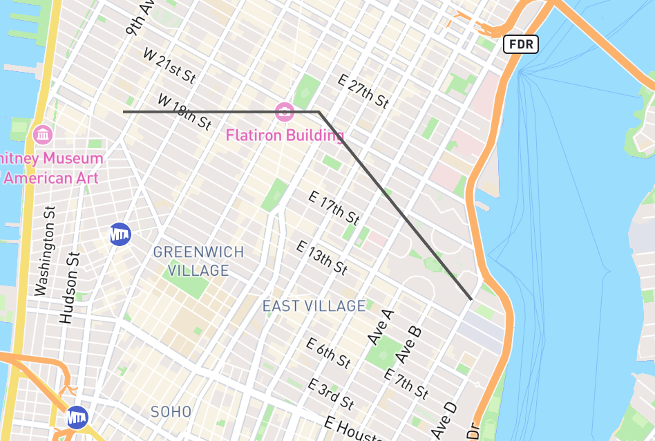
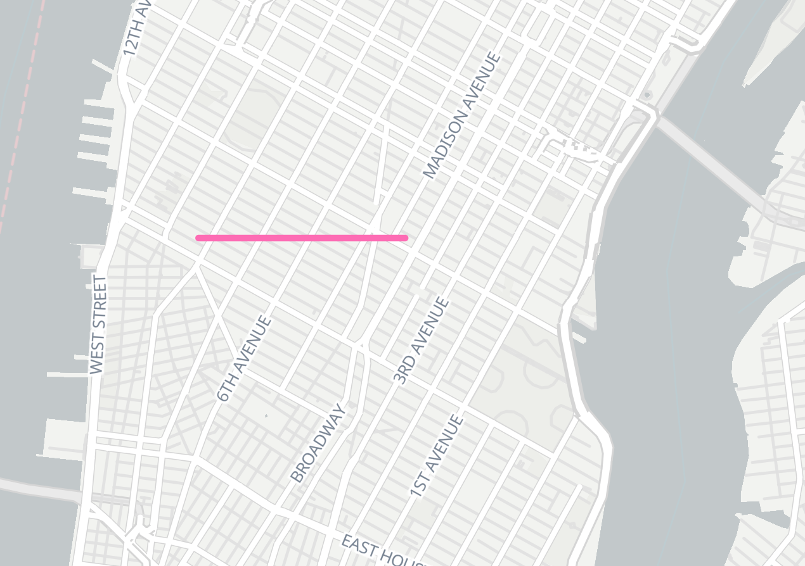

PostGIS Line Bug Reproduction
===

### Install

```
npm install
```

### Bug description

I'm hosting a table of four points in PostGIS and querying it to create a vector tile layer of a line connecting the points. See the [`create-table.js`](./create-table.js) for table creation and data.

The second and third points in the table are the same.

The linestring as GeoJSON is this:

```json
{
  "type": "FeatureCollection",
  "features": [
    {
      "type": "Feature",
      "properties": {},
      "geometry": {
        "coordinates": [
          [
            -74.002571106,
            40.741008759
          ],
          [
            -73.986976624,
            40.741008759
          ],
          [
            -73.974761963,
            40.729633331
          ],
          [
            -73.986976624,
            40.741008759
          ]
        ],
        "type": "LineString"
      }
    }
  ]
}
```

The problem is when I load the vector tile layer in MapLibre or Mapbox GL JS, the third point does not show up. If points 2 and 4 are not identical, then it shows the line properly so I think the problem is with the line double backing on itself but I can't figure out why or how to fix it.

Here's what the line should look like:



Versus what it actually does (disregard line style)



### Steps to reproduce

1. Rename [`.env.sample`](./.env.sample) to `.env` and add your postgres connection credentials
2. Add your own basemap layer in `index.html`
3. Create the table and load data with `node create-table.js`
4. Run the tile server with `npm run tile-server`
5. Run the web server with `npm run web-server`

Navigate to `http://127.0.0.1:8080`

You'll see this:


